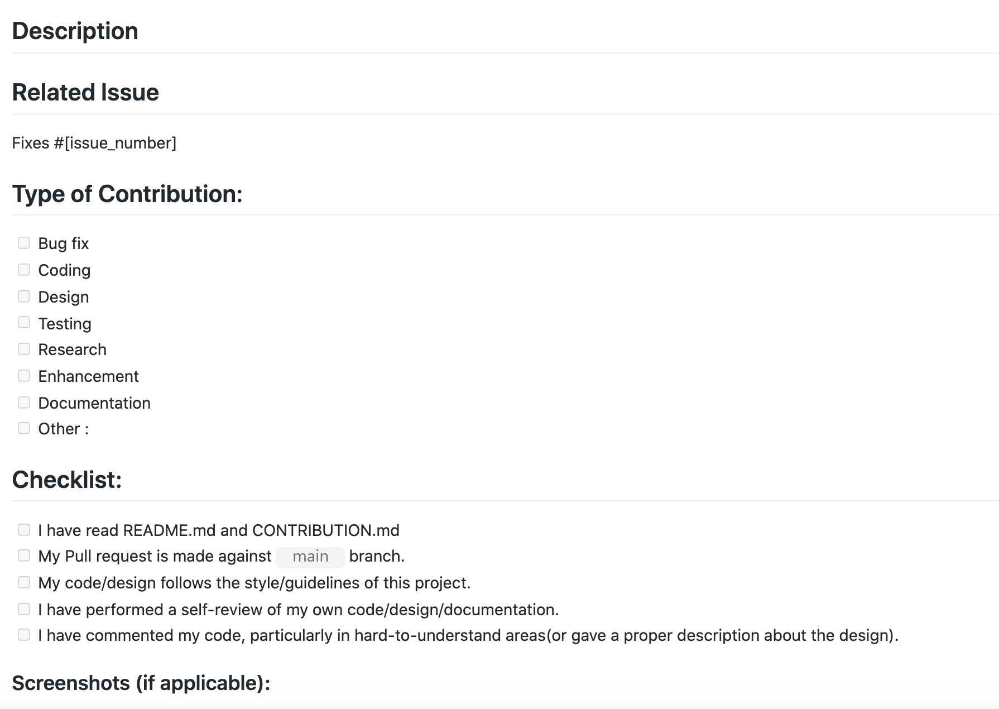

## 📌 Contributing Guidelines  
  
This documentation contains a set of guidelines to help you during the contribution process.
 
We are happy to welcome all the contributions from anyone willing to improve this project. Thank you for helping out and remember, **no contribution is small.** 
 
- Participants are expected to follow project guidelines and coding style.
- Each participant/contributor will be assigned **2 issues (max)** at a time to work on.
- Participants/contributors have to give an update about their work while completing issues. If not then the issue will be assigned to another. The expected time period for submitting a pull request for each level:

   - Level 1 - 2 Day
   - Level 2 - 2 Days
   - Level 3 - 3 Days
   - Level 4 - 5-6 Days
   
   If you need extra time, do comment on the issue and let the maintainer know.

- Participants/contributors have to **comment** on issues they would like to work on, and mentors will assign you. Direct PRs for Open to all issues.
- Issues will be assigned on a **first-come, first-serve basis**.
- Participants/contributors can also **open their issues**, but it needs to be verified and labeled by a mentor.
- Before opening a new issue, please **check** if it is already created or not.
- Pull requests will be merged after being **reviewed by a mentor**.
- Create a pull request from a **branch** other than `main`, which means you have to create a new branch for every pull request.
- It might take a day to review your pull request. Please have patience and be nice.
- We all are here to learn. You are allowed to make mistakes. That's how you learn, right!
 
- **MAKE SURE TO OPEN A DRAFT PR AS SOON AS YOU START WORKING ON AN ISSUE AND KEEP COMMITTING TO IT SO THAT WE CAN KNOW THAT YOU ARE WORKING ON THAT PARTICULAR ISSUE**
 
- Pull Requests review criteria:
  - Please fill the **PR template** properly while making a PR.
  - Example of the **PR template**
  
 
- **For any queries or discussions, please drop a message.**