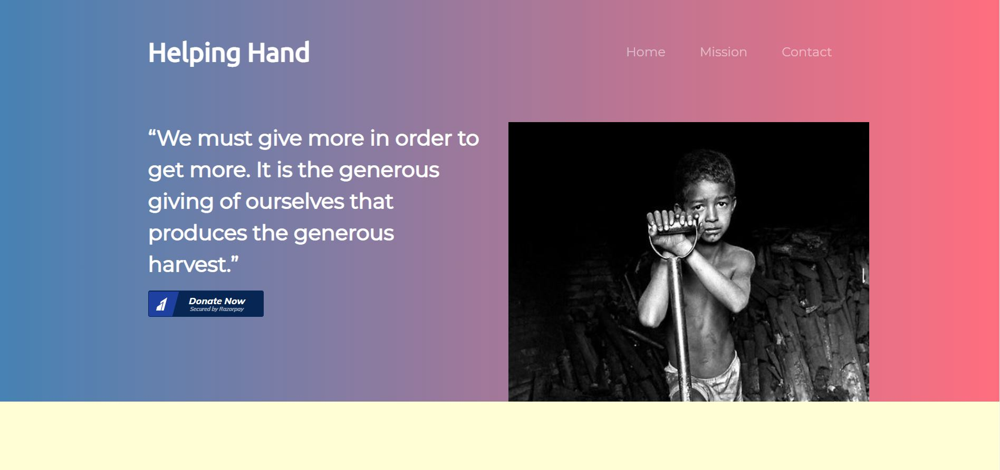
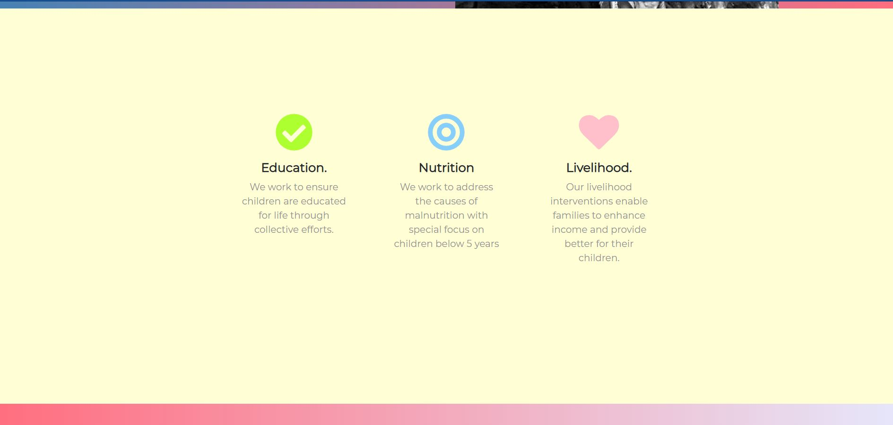
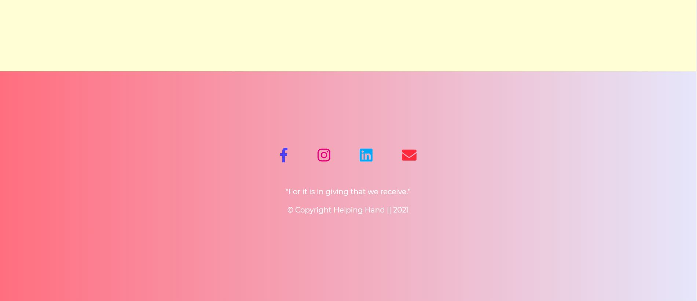

# Helping Hand

### Make a Donation.
Save Lives.


## Mission

There are thousands of children in the world who receive little to nothing to eat when they are not at school. <b>Helping Hand</b> is here to provide these children with nutritious food so that they can grow, learn, and thrive among their peers. 
Additionally, we believe in the power of a community working together toward the common goal of fighting malnutrition in our country.
<b>Helping Hand</b> wants to improve the quality of life and empower the children of rural arears with the tools and resources to be able to read and write.
When you donate to us, you partner with us in achieving our mission of transforming lives and neighborhoods through affordable housing and supportive programs. Your support will help families in need and those with special needs, support seniors and give new hope to the homeless.

Even helping one individual can make a small change for the better.


<!-- 
You can end childhood hunger, even a small donation from you can make a big change.... -->
  

 ## About</br>
  <b>Helping Hand is a payment integrated donation website, that strives to help people in need. Without any hassle, you can donate with just the click of a button.</b></br>


 ## Payment way Integrated-
    Razorpay


 ## Text Editor-
    Sublime Text <3</br>


## Link to the website
https://soumita1234.github.io/HelpingHand/ 
</br>

## Tech Stacks
</br>

<p>
     
   	
   
</p>
</br>


# Preview of the website 

### Home Page:
<p align="center">
 &ensp;&ensp;&ensp;

</p>

### Mission Page:
<p align="center">
 &ensp;&ensp;&ensp;

</p>

### Contact Page:
<p align="center">
 &ensp;&ensp;&ensp;

</p>

 # CONTRIBUTION GUIDELINES

If you think that you can add a new feature or want to fix a bug. We invite you to contribute to Helping Hand and make this project better.
To start contributing, follow the below guidelines: 
 

 
 Open git bash and type the command.
```
git clone https://github.com/<your-user-name>/HelpingHand.git
```

 Now open the project with the code/ text editor of choice.


 Navigate to the project directory.

 Add a reference(remote) to the original repository.

```
git remote add upstream https://github.com/soumita1234/HelpingHand.git
```

 Check the remotes for this repository.

```
git remote -v
```

 Always take a pull from the upstream repository to your main branch to keep it updated as per the main project repository.

```
git pull upstream main
```

 Create a new branch(prefer a branch name that relates to your assigned issue).

```
git checkout -b <YOUR_BRANCH_NAME>
```

 Perform your desired changes to the code base.

Check your changes.

```
git status
```

 Add, Commit and Push.
 ```
git add . <\files_that_you_made_changes>
```
```
git commit -m "relavant message"
```
```
git push -u origin <your_branch_name>
```


 Then in GitHub, in your cloned repository, find the option to make a pull request. 

Create a PR.

**Congratulations!** Sit and relax, you've made your contribution to the project.
</br>


<h1 align="center"> Project Admin </h1>
</br>
<p align="center">
&ensp;&ensp;&ensp;
</p>
</br>

<h3 align="center">Soumita Biswas</h3>

<!-- #58908901 -->